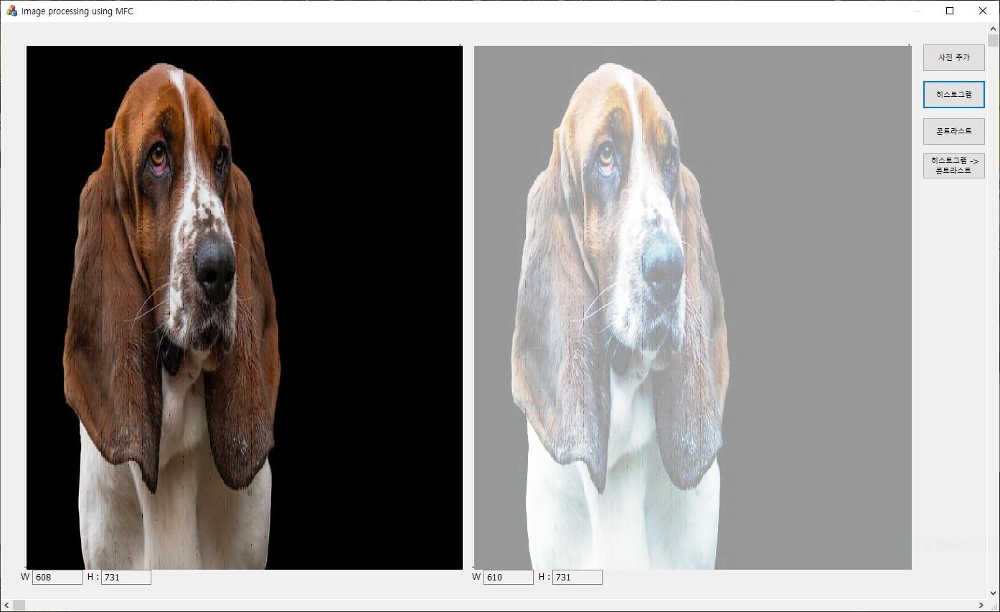
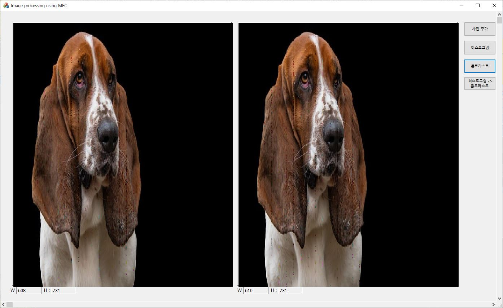
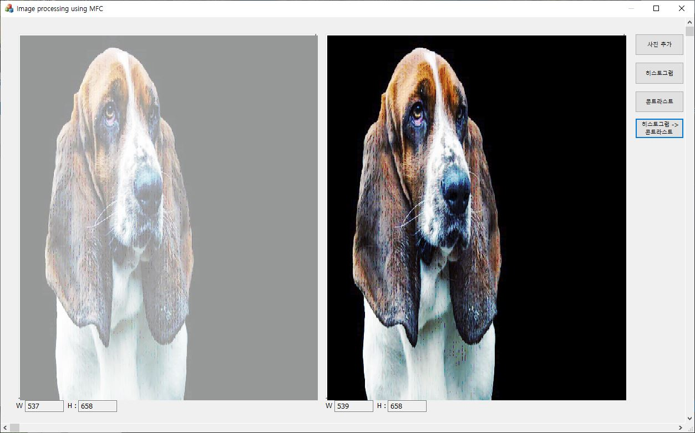

---

# 🎨 MFC를 활용한 이미지 처리 프로젝트

안녕하세요! 이 프로젝트는 MFC(Microsoft Foundation Classes)를 활용하여 구현한 이미지 처리 응용 프로그램입니다. 다양한 이미지 처리 기능을 학습하고 적용하며 개발한 결과물로, **컴퓨터 공학과 소프트웨어 개발에 대한 열정**을 담아낸 포트폴리오입니다. 😊

---

## 📌 주요 기능
1. **이미지 로드 및 저장**  
   - 다양한 이미지 파일 형식을 로드.
   - BMP, PNG, JPG 등 주요 이미지 포맷 지원.
     
2. **이미지 처리 기능**  
   - **콘트라스트**: 이미지의 밝기와 어두운 영역 간의 차이를 강조하거나 조정.
   - **히스토그램 평활화**: 픽셀 값 분포를 균등하게 만들어 대비를 향상.
   - **히스토그램 평활화 -> 콘트라스트**: 더 명확한 경계선과 선명한 디테일이 강조.

3. **UI/UX 디자인**  
   - 심플한 디자인을 기본으로 상하좌우 크기를 넓혀 실시간 X * Y 사이즈 체크 가능.

---

## 🚀 프로젝트 실행 방법
1. **레포지토리 클론**
   ```bash
   git clone https://github.com/JungHoiSun0522/portfolio.git
   ```
2. **Visual Studio에서 프로젝트 열기**
   - Visual Studio 2019 이상 권장.
   - 프로젝트 파일(*.sln*)을 열고 빌드 및 실행.

3. **사용법**
   - 메뉴를 통해 이미지를 로드하고, 다양한 이미지 처리 기능을 테스트해보세요!

---

## 📂 프로젝트 구조
```
Image processing using MFC/
├── res/                  # 리소스 파일
├── src/                  # 주요 소스 코드
│   ├── MainFrame.cpp     # 메인 프레임 설정
│   ├── ImageProcess.cpp  # 이미지 처리 로직
│   └── UIHandler.cpp     # UI 이벤트 처리
├── ImageProcessingApp.sln # Visual Studio 솔루션 파일
└── README.md             # 프로젝트 설명 파일
```

---

## 🛠️ 사용 기술 및 도구
- **프로그래밍 언어**: C++
- **프레임워크**: MFC (Microsoft Foundation Classes)
- **개발 도구**: Visual Studio 2019
- **알고리즘**: 이미지 처리 및 필터링 알고리즘 (Contrast Adjustment, Histogram Equalization 등)

---

## 📸 데모 화면
| 기본 화면 | 히스토그램 평활화 | 콘트라스트 | 히스토그램 평활화 -><br> 콘트라스트 |
|:---:|:---:|:---:|:---:|
|  |  |  |  |

- ### 히스토그램 평활화
   - **원본사진(왼쪽)을 대상으로 히스토그램 평활화 진행**

- ### 콘트라스트
   - **원본사진(왼쪽)을 대상으로 콘트라스트 진행**

- ### 히스토그램 평활화 -> 콘트라스트
   - **원본사진(왼쪽)을 대상으로 히스토그램 평활화 진행하여 원본 사진 위치에 표현**
   - **히스토그램 평활화 사진을 콘트라스트하여 오른쪽에 표현**
---

## 📩 문의
궁금한 점이나 문의 사항은 아래 이메일로 연락 주시면 성실히 답변드리겠습니다!  
📧 **siunm6610@naver.com**

---
