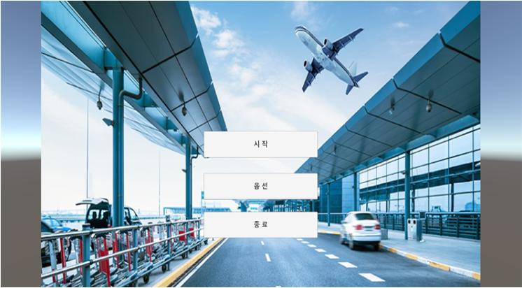
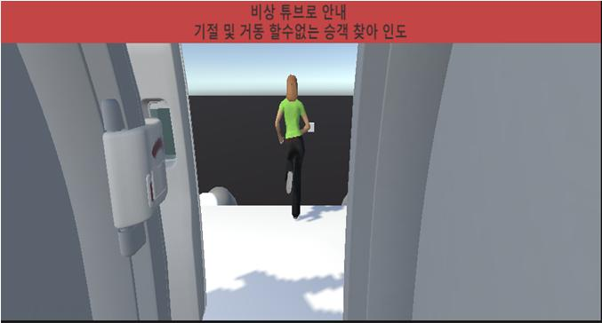

---

# 🛫 VR HMD를 활용한 비정상비행 승무원 교육훈련 콘텐츠 (Abnormal Flight Training)

**VR HMD를 활용한 비정상비행 승무원 교육훈련 콘텐츠**은 비행 시뮬레이터를 활용하여 비행 중 발생할 수 있는 이상 상황을 학습하고 대처하는 능력을 향상시키기 위한 교육용 소프트웨어입니다. 이 시스템은 항공 승무원들이 실제 비행 전에 다양한 시나리오를 경험하고, 위기 상황에서의 대응 능력을 강화하는 것을 목표로 합니다.

---

## 📌 주요 기능

| **구분** | **기능**                    | **설명**                                                                 |
|----------|-----------------------------|--------------------------------------------------------------------------|
|          | 메인화면                    | 기체 비정상 교육 콘텐츠의 메인 화면이다. 사용자는 훈련 시작, 시스템 설명 등 선택할 수 있다. |
|          | 환경설정                    | 음량 등 조절할 수 있다.                                                  |
|   S/W    | 항공기 기체 떨림 및 흔들림 | 항공기 운항 중 비정상 상황에 맞춰 떨림 및 흔들림을 구현.                  |
|          | 항공기 탈출 Door 구현      | 항공기 운항 중 비정상 상황에 맞춰 비상 상황 시 탈출구 Door 상호작용.       |
|          | 항공기 나레이션            | 항공기 운항 중 비정상 상황에 맞춰 대처 방향을 나레이션으로 제시.           |

---

## 🚀 설치 및 실행 방법

1. **레포지토리 클론**
   ```bash
   git clone -b 3rd_pjt --single-branch https://github.com/JungHoiSun0522/portfolio.git
   ```
2. **필요한 의존성 설치**
   - Unity 설치
   - 에디터 버전 2020.3.37f1 (64-bit) 설치
3. **프로그램 실행**
   - Oculus Quest2
---

## 📂 프로젝트 구조

```
AbnormalFlightTraining/
├── Asset/                             # 비행 데이터 및 로그 파일
│   ├── Animation/                     # 승객 에셋 애니메이션 모음 폴더
│   ├── aniamteController/             # 애니메이션 컨트롤러
│   ├── dooranimation/
│      ├── Door_Iatch_10.anim          # 문의 latch를 움직임을 구현
│      ├── Door_door_10.anim           # 문이 열리는 동작을 구현
│      └── DoorController.controller   # latch가 당겨졌을 때 문이 열리게 컨트롤 설정
ㆍㆍㆍ
│   └── Scripts/
│      ├── CameraShake.cs              # 카메라 흔들림으로 기체 흔들림 구현
│      ├── LightBlink.cs               # 기체가 흔들리는 동안 불빛이 깜빡이도록 구현
│      ├── Exit.cs                     # 기체 흔들림 후 승객들이 줄을 서는 것과 콜라이더를 이용한 트리거로 run.cs 호출 구현
│      ├── run.cs                      # 탈출 시 도착지점을 설정. 도착지점 도달을 SetDestination으로 구현
│      └── Ending.cs                   # 상황 종료 후 메인으로 돌아가기 또는 종료 구현
ㆍㆍㆍ
├── OVRAssetBundles/OVRMasterBundle/   
├── ProjectSettings/
├── UserSettings/                  
└── README.md                          # 프로젝트 설명서
```

---

## 🛠️ 사용 기술

- **프로그래밍 언어**: C#
- **개발 도구**: OVR Metrics Tool
- **게임 엔진**: Unity3D + 2020.3.37f1 (64-bit)

---

## 📸 스크린샷

| 시작 화면 | 기체흔들림 및 <br>승객 탈출 유도 | 승객 탈출 |
|:---:|:---:|:---:|
|  |  |  |

---

## 📩 문의

프로젝트에 대한 문의 사항이 있으시면 아래 이메일로 연락 주시기 바랍니다.

📧 **siunm6610@naver.com**

---
