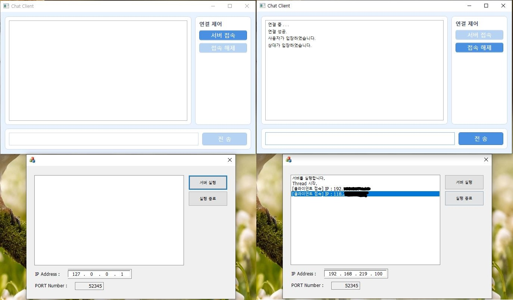
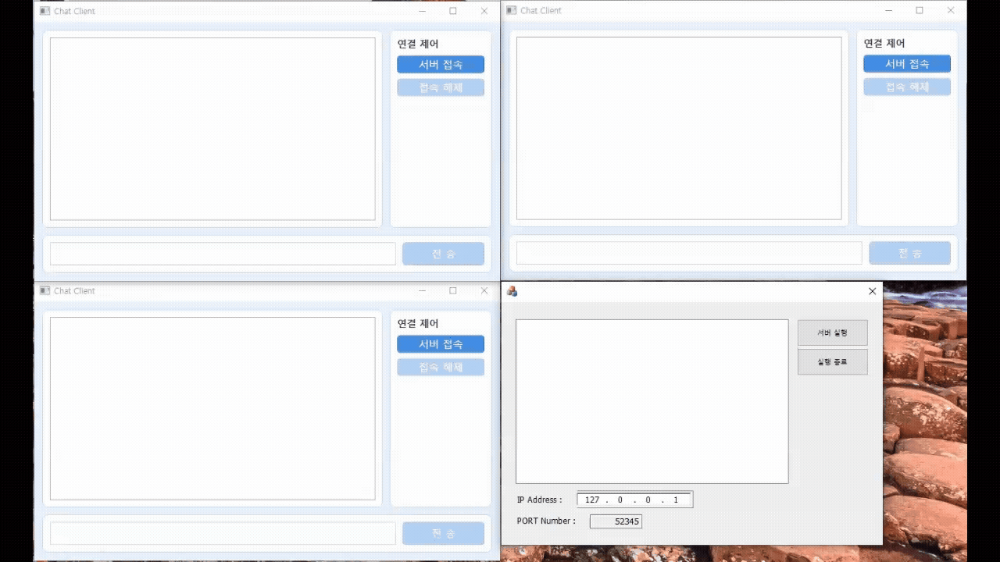
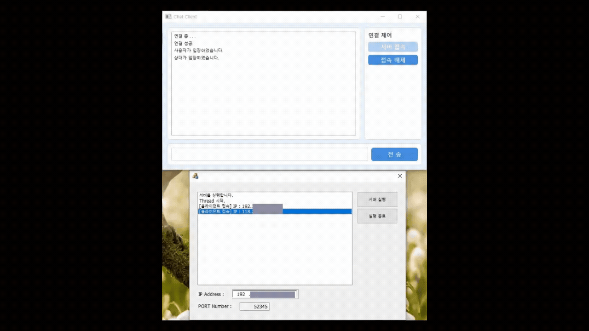

# 💬 TCP 멀티 유저 채팅 프로그램

<p align="center">
  <strong>WinSock 기반 TCP 서버(MFC)와 WPF 클라이언트로 구현한 멀티 유저 채팅 프로젝트</strong>
</p>

<p align="center">
  <sub>Low-level Socket Programming · Multi-threaded Server · Windows</sub>
</p>

---

## 📌 프로젝트 개요

본 프로젝트는 WinSock API를 직접 사용하여 TCP 서버를 구현하고,  
MFC 기반 서버와 WPF 기반 클라이언트로 구성한 멀티 유저 채팅 프로젝트입니다.

서버는 하나의 listen 소켓으로 다수의 클라이언트 접속을 처리하며,  
각 클라이언트는 전용 스레드에서 송수신을 수행합니다.  
클라이언트는 UI 스레드와 네트워크 스레드를 분리하여  
네트워크 대기 중에도 UI가 멈추지 않도록 구성했습니다.

---

## 🛠 개발 환경

| 구분 | 내용 |
|---|---|
| **IDE** | Visual Studio 2019 |
| **Server** | C++ / MFC / WinSock2 (TCP) |
| **Client** | C# / WPF (.NET Framework 4.7.2) |
| **Encoding** | UTF-8 |
| **OS** | Windows10 |

---

## 🧩 전체 구조

```text
Client (WPF)
   └─ TCP Socket
        ↓
Server (MFC)
   ├─ Listen Socket
   ├─ Accept Thread
   ├─ Client Thread (1 per client) // 클라이언트마다 개별 쓰레드 생성
   └─ Broadcast Logic
```

- 단일 listen 소켓으로 접속 요청 수신  
- accept 이후 클라이언트 전용 소켓 생성  
- 클라이언트마다 독립적인 송수신 스레드 운영  
- 서버에서 수신한 메시지를 다른 클라이언트로 전달  

---

## ⚙ 서버 주요 구현 내용 (MFC)

### ▸ Listen / Accept 구조
- socket → bind → listen 순으로 서버 소켓 초기화  
- listen은 서버 소켓을 수신 대기 상태로 전환하는 용도로 1회만 호출  
- accept 전용 스레드에서 클라이언트 연결 처리  

### ▸ 멀티 클라이언트 관리
- 접속된 클라이언트를 vector<CLIENT_INFO>로 관리  
- CLIENT_INFO 구성  
  - SOCKET  
  - 클라이언트 IP 문자열  
- 동시 접근 보호를 위해 CCriticalSection 사용  

### ▸ 클라이언트 스레드 모델
- 클라이언트마다 전용 스레드 생성  
- recv 반환값 기준 분기 처리  
  - recv > 0 : 정상 메시지 수신  
  - recv == 0 : 클라이언트 연결 종료  
  - recv < 0 : 통신 오류  
- 연결 종료 시 클라이언트 목록에서 제거  

### ▸ 메시지 브로드캐스트
- 메시지를 보낸 클라이언트를 제외한 나머지 클라이언트에게 전달  
- 접속/해제 알림 메시지와 일반 채팅 메시지 구분 처리  

### ▸ 서버 종료 처리
- 서버 종료 시 listen 소켓 closesocket으로 accept 차단  
- 강제 스레드 종료 함수 미사용  
- 스레드가 자연스럽게 종료되도록 설계  

---

## 🔤 문자열 처리 및 인코딩

- 네트워크 통신은 UTF-8 문자열 기준  
- 서버 내부에서는 CString 사용  
- UTF-8 문자열과 CString 간 변환을 명시적으로 처리하여  
  한글 메시지 깨짐 문제를 해결  

---

## 🖥 클라이언트 주요 구현 내용 (WPF)

### ▸ UI / 네트워크 스레드 분리
- 네트워크 통신은 별도 스레드에서 수행  
- UI 갱신은 Dispatcher.Invoke를 통해 UI 스레드에서 처리  
- 네트워크 대기 중 UI 프리징 현상 방지  

### ▸ 채팅 로그 UI
- ListBox 기반 채팅 로그 출력  
- 새 메시지 수신 시 자동으로 마지막 항목으로 스크롤  
- 사용자가 중간 항목을 선택하더라도 이후 메시지는 다시 하단으로 이동  

### ▸ 접속 / 해제 처리
- 서버 접속 및 해제 시 소켓 상태 안전하게 관리  
- 연결 중 해제 시 발생하는 예외 상황 처리  

---

## ▶ 실행 방법

```bash
git clone -b 4th_pjt --single-branch https://github.com/JungHoiSun0522/portfolio.git
```

1. 서버 프로그램 실행  
2. 클라이언트에서 이미 설정된 서버 IP 및 포트로 접속  
3. 메시지 송수신  

## ⚠ 한계 및 개선 방향

- IOCP 기반 비동기 서버 구조 미적용  
- TLS/암호화 통신 미적용  
- 채팅방 분리 및 사용자 식별 기능 미구현  

---

## 📂 저장소 구조

```text
ChatProject/
├─ Server_MFC/
│  ├─ *.cpp
│  ├─ *.h
│  └─ Resource/
├─ Client_WPF/
│  ├─ *.xaml
│  └─ *.cs
└─ README.md
```

---

## 📸 테스트 화면
| 기본 화면 | 내부 IP로 접속한 클라이언트 | 외부 IP로 접속한 클라이언트 | 강제 서버 종료 | 서버 정상 종료 |
|:---:|:---:|:---:|:---:|:---:|
|  |  |  |  |  |

---

## 📩 문의
궁금한 점이나 문의 사항은 아래 이메일로 연락 주시면 성실히 답변드리겠습니다!  
📧 **siunm6610@naver.com**

---
