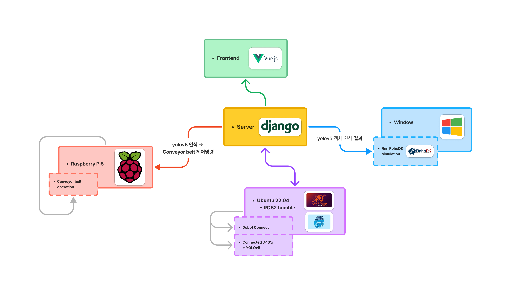
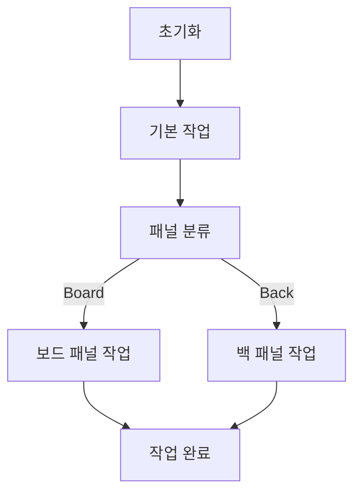

# 📺 스마트 TV 생산 라인 자동화 솔루션

> **RealSense + 비전 인식 + 로봇 암 + 컨베이어를 통합한 생산 라인 자동화 프로젝트**  
> 패널을 실시간으로 인식하고, 분류 기준에 따라 로봇과 설비를 연동 제어하는 통합 자동화 시스템입니다.

---

## 🔍 프로젝트 개요

스마트 TV 생산 공정에서 **패널 종류를 자동으로 인식하고, 로봇 암과 컨베이어를 연동하여 분류·이송하는 자동화 솔루션**을 구현했습니다.

- 비전 기반 패널 인식으로 작업자의 개입을 최소화
- 로봇 암 + 컨베이어 벨트 연동을 통한 공정 자동화
- ROS2 기반 통신 구조로 장비 간 동작을 통합 관리
- RoboDK 시뮬레이션을 통해 실제 장비 투입 전 동작 검증

---

## 개발 환경

- **운영 체제**: Ubuntu 22.04 (서버), Raspberry Pi OS (컨베이어 제어)
- **프로그래밍 언어**: Python 3.8, JavaScript (Vue.js)
- **주요 하드웨어**:
    - Dobot Magician (로봇)
    - Intel RealSense D435i (카메라)
    - Raspberry Pi (컨베이어 제어)
- **주요 소프트웨어**:
    - YOLOv5 (객체 탐지 모델)
    - ROS2 (로봇 제어 및 데이터 통신)
    - RoboDK (시뮬레이션)
    - Django (백엔드 서버)
    - Vue.js (프론트엔드)

---

## 🧱 시스템 구성

### 하드웨어
- **Dobot Magician** : 패널 픽업 및 조립 구역 이송
- **Intel RealSense D435i** : 패널 이미지 획득
- **Raspberry Pi** : 컨베이어 벨트 제어

### 소프트웨어
- **ROS2** : 로봇·비전·설비 간 통신
- **YOLOv5** : 패널 객체 탐지 및 분류
- **RoboDK** : 로봇 작업 시뮬레이션
- **Django / DRF** : 매크로 및 작업 데이터 관리
- **Vue.js** : 작업 흐름 및 매크로 제어 UI

---

## 🔄 전체 작업 흐름

1. RealSense 카메라로 패널 이미지 획득  
2. 비전 모델을 통해 패널 종류 분류  
3. 분류 결과를 기반으로 컨베이어 방향 제어  
4. Dobot Magician이 패널을 픽업하여 지정 위치로 이송  
5. 전체 작업 흐름을 RoboDK에서 시뮬레이션 및 검증  
6. 프론트엔드 UI를 통해 매크로 생성·수정·실행  

---

## 🧠 핵심 기능

### 1️⃣ 객체 탐지 및 패널 분류
- 실시간 이미지 입력을 기반으로 패널 종류를 자동 분류
- 보드 패널 / 백 패널 구분 결과를 설비 제어 로직에 전달
- 인식 결과에 따라 컨베이어 및 로봇 동작이 자동 결정됨

---

### 2️⃣ 컨베이어 벨트 제어

- Raspberry Pi를 이용해 컨베이어 벨트 동작 제어
- 패널 분류 결과에 따라 **좌/우 이동 또는 다음 공정 이송**
- 스텝 모터로 이동 방향·속도 제어
- 서보 모터로 패널 위치 조정 및 분기 처리

**컨베이어 제어 특징**
- 가속·감속을 고려한 안정적인 모터 동작
- 명령 기반 제어 구조로 로봇/서버와 연동 가능
- 작업 중단 및 재개 상황을 고려한 상태 관리

---

### 3️⃣ Dobot Magician 로봇 암 제어

- 흡착컵을 이용해 패널을 픽업 및 배치
- ROS2 Action 기반으로 로봇 위치 제어
- 작업 시작 전 Homing을 통해 기준 위치 보정
- 작업 순서를 JSON 기반 매크로로 관리

**로봇 제어 특징**
- 이동(move) / 흡착(gripper) 동작을 단계별로 분리
- 작업 재사용이 가능한 매크로 구조
- 실제 장비 동작과 시뮬레이션 흐름을 동일하게 유지

---

### 4️⃣ RoboDK 시뮬레이션

- 실제 로봇 투입 전 작업 흐름을 시뮬레이션
- 패널 종류에 따라 작업 시퀀스를 분기 처리
- 작업 상태 및 패널 수량을 기반으로 동작 스케줄링

---

## 🖥 프론트엔드 (Vue.js)

- 매크로 기반 작업 관리 UI 구현
- 작업 단계 생성·수정·실행 가능
- 실시간 작업 상태 확인

**주요 기능**
- 매크로 목록 관리
- 단계별 작업 흐름 시각화
- 작업 실행 결과 확인

---

## 🗄 백엔드 (Django / DRF)

- 매크로 및 작업 단계 데이터 관리
- 로봇·컨베이어 작업 로그 저장
- JSON 기반 데이터 구조로 확장성 고려

**REST API 역할**
- 매크로 생성 및 조회
- 작업 단계 관리
- 최근 실행 작업 상태 조회

.png)

---

## ✅ 구현 결과

### 📌 프론트엔드 UI
.png)
.png)
.png)
.png)
.png)
.png)

### 🤖 로봇 자동 작업

---

## 🎯 프로젝트 요약

- 비전·로봇·설비를 **단일 작업 흐름으로 통합**
- 실제 생산 라인을 가정한 자동 분류·이송 구조 구현
- 시뮬레이션 → 실제 장비 연동까지 고려한 설계 경험

---
